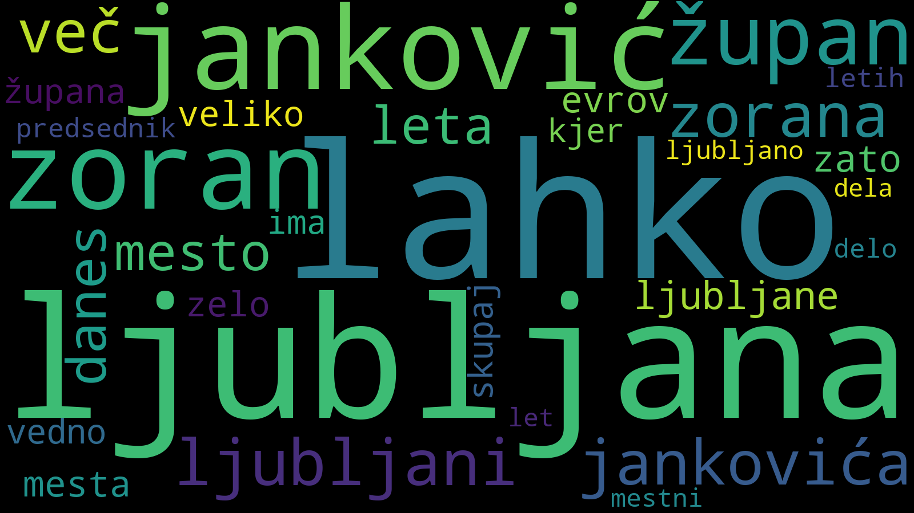

Besedni oblaki ("word cloud") novic političnih strank.
Naredite lahko tri oblake: pogostost besed, lem, imenovanih entitet.
Primer LZJ, besede:

**Zahteve**
- NLTK
- Scrapy
- Lemmagen
- slo_ner_service

Prve tri lahko namestite s pip, [zadnjega](https://github.com/izacus/slo_ner_service) morate namestiti in pognati ročno [z Jetty](https://www.eclipse.org/jetty/) ali čim podobnim. 
Naslov storitve lahko spremenite z NER_URL konstanto v settings.py. 

**Uporaba**

Ustvarite mape, ki so potrebne:

`mkdir data/db`
`mkdir log`

Najprej poberite podatke, ki jih potrebuje NLTK:

`python util/dl.py`

Nato delamo v treh korakih:

1. najprej počohamo novice:
`python scrape.py -stranka [stranka]`
Izbirate lahko med ['sds','pirati','sls','nsi','desus','levica','lms','smc','sd','sab','dl','lzj'].
Ta ukaz uporablja privzete vrednosti Scrapyevih nastavitev. Spremenite jih lahko v settings.py. 

POZOR: ta ukaz ne preverja če so novice že v bazi, zato morate pred ponovnim zagonom ukaza izbrisati bazo `data/db/<stranka>.db`
POZOR: ta ukaz lahko traja zelo dolgo, predvsem pri SDS, ki ima okoli 15k novic.

2. procesiramo zbrane novice
`python process.py -stranka [stranka] -l -w -n`
Izbirate lahko med ['sds','pirati','sls','nsi','desus','levica','lms','smc','sd','sab','dl','lzj'].
Privzeto procesira vse, lahko pa izberete kaj želite procesirati: besede (-w), leme (-l), imenovane entitete (-n) 

POZOR: ta ukaz lahko traja zelo dolgo, predvsem pri SDS, ki ima okoli 15k novic.

3. ustvarimo besedni oblak
`python word_cloud.py -stranka [stranka]`
Izbirate lahko med ['sds','pirati','sls','nsi','desus','levica','lms','smc','sd','sab','dl','lzj'].

**Rezultati**

Počohane novice so v:

`data/db/[stranka].sqlite`
 
Procesirane besede so v:

`data/processed/[stranka]_[all | lemmatized | ner].pickle`
, kot "picklan" objekt Counter.

Besedni oblaki so v:

`data/cloud/[stranka]_[all | lemmatized | ner].png`